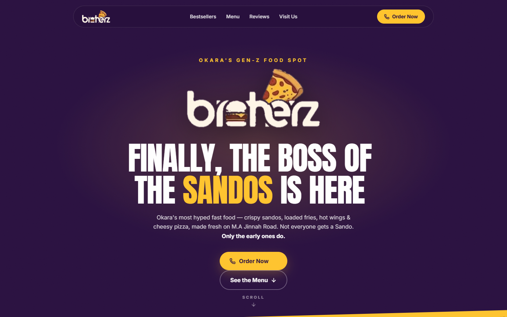

# Brotherz — Restaurant Website

**[Live demo →](https://aayansheraz.github.io/brotherz-website/)**



Scroll-animated landing page for **Brotherz Pk** (Okara). React + TypeScript + Vite + Tailwind CSS v4 + lucide-react.

## Run locally

```bash
npm install
npm run dev      # http://localhost:5173
```

## Build for hosting

```bash
npm run build
```

Upload the contents of `dist/` to any static host (same as your shared hosting — the whole site is static files).

## Things to customize

- **Prices & menu items** → [src/data/menu.ts](src/data/menu.ts). Prices are realistic placeholders — confirm real ones with the restaurant before launch.
- **Phone / address / hours / links** → the `INFO` object at the bottom of [src/data/menu.ts](src/data/menu.ts).
- **Hero carousel items** → the `ITEMS` array in [src/components/Hero.tsx](src/components/Hero.tsx).
- **Bestseller photos** → `CARDS` in [src/components/Bestsellers.tsx](src/components/Bestsellers.tsx) (currently Unsplash food photos; swap for real Brotherz shots when available — real photos will sell it even harder).
- **Brand colors** → CSS variables in [src/index.css](src/index.css).

3D food icons are Microsoft Fluent Emoji (MIT licensed), bundled in `public/img/`.
